# logic-development


# 🧠 Logic Development

Welcome to the **Logic Development** repository – a project focused on building and exploring logic-based systems, algorithms, and frameworks. Whether you're diving into symbolic logic, logical programming, or just exploring core logic components, this project is your launchpad.

---

## 🚀 Project Overview

This project is designed to:

- Explore logical reasoning and systems
- Build reusable logic components
- Develop tools for logic-based applications
- Integrate with various programming environments

---


---

## 🛠️ Technologies Used

- Language: `java ` / `Python` / `JavaScript` / `TypeScript` / `C++` 
- Tools: `IntelliJ IDEA`/`VSCode`, `Node.js`, `PyTest`, `Jest`, `Make`, etc.
- Logic Libraries: `Z3`, `Prolog`, `SymPy`, etc.

---

## 📦 Installation

```bash
# Clone the repository
git clone https://github.com/shreyamahalle/logic-development.git

# Navigate to the project folder
cd logic-development

# Install dependencies (example for Node.js)
npm install

```
💡 Examples
- Here are a few cool examples included:

- Truth table generator

- Symbolic logic evaluator

- Logical puzzle solver

- Predicate logic engine

```mermaid
---
title: foodease-food-order-booking-system (Extended)
---
classDiagram

 note " food order booking management "

class Customer {
  +int customerId
  +String firstName
  +String lastName
  +String email
  +String phone
  +String address
  +createCustomer()
  +updateCustomer()
  +displayCustomer()
}

class Restaurant {
  +int restaurantId
  +String name
  +String cuisineType
  +String address
  +String contact
  +String openingHours
  +createRestaurant()
  +updateRestaurant()
  +displayRestaurant()
}

class Order {
  +int orderId
  +Date orderDate
  +String deliveryAddress
  +String status
  +createOrder()
  +updateOrder()
  +displayOrder()
}

class Payment {
  +int paymentId
  +String paymentMethod
  +double amount
  +String status
  +Date paymentDate
  +createPayment()
  +updatePayment()
  +displayPayment()
}

class DeliveryAgent {
  +int agentId
  +String name
  +String vehicleNumber
  +String contact
  +String status
  +createDeliveryAgent()
  +updateDeliveryAgent()
  +displayDeliveryAgent()
}

class Feedback {
  +int feedbackId
  +int rating
  +String comments
  +Date feedbackDate
  +createFeedback()
  +displayFeedback()
}

class Review {
  +int reviewId
  +int rating
  +String comments
  +Date reviewDate
  +createReview()
  +displayReview()
}

class OrderStatus {
  +int statusId
  +String status
  +Date statusDate
  +createOrderStatus()
  +displayOrderStatus()
}

class BookingTable {
  +int bookingId
  +Date bookingDate
  +int numberOfPeople
  +String specialRequests
  +createBooking()
  +updateBooking()
  +displayBooking()
}

%% New Classes
class MenuItem {
  +int menuItemId
  +String name
  +String description
  +double price
  +boolean isAvailable
  +createMenuItem()
  +updateMenuItem()
  +displayMenuItem()
}

class Notification {
  +int notificationId
  +String message
  +Date sentDate
  +boolean isRead
  +sendNotification()
  +markAsRead()
  +displayNotification()
}

class Coupon {
  +int couponId
  +String code
  +double discount
  +Date expiryDate
  +boolean isActive
  +applyCoupon()
  +validateCoupon()
  +displayCoupon()
}

Customer "1" --> "*" Order : places
Customer "1" --> "*" Feedback : provides
Customer "1" --> "*" Review : writes
Customer "1" --> "*" BookingTable : makes

Restaurant "1" --> "*" Order : receives
Restaurant "1" --> "*" Review : has
Restaurant "1" --> "*" BookingTable : accepts

Order "1" --> "1" Payment : has
Order "1" --> "1" DeliveryAgent : assigned to
Order "1" --> "*" OrderStatus : has

Payment --> Customer : paid by
DeliveryAgent --> Order : delivers

%% New Relationships
Restaurant "1" --> "*" MenuItem : offers
Order "*" --> "*" MenuItem : contains
Customer "1" --> "*" Notification : receives
Coupon "*" --> "*" Order : applied to

class CustomerController {
  +createCustomer()
  +getCustomer()
  +updateCustomer()
  +deleteCustomer()
}

class RestaurantController {
  +createRestaurant()
  +getRestaurant()
  +updateRestaurant()
  +deleteRestaurant()
}

class OrderController {
  +createOrder()
  +getOrder()
  +updateOrder()
  +cancelOrder()
}

CustomerController --> CustomerService
RestaurantController --> RestaurantService
OrderController --> OrderService

class CustomerService {
  +registerCustomer()
  +authenticateCustomer()
  +updateCustomerProfile()
}

class RestaurantService {
  +registerRestaurant()
  +updateRestaurantInfo()
  +manageMenu()
}

class OrderService {
  +placeOrder()
  +trackOrder()
  +cancelOrder()
}

CustomerService --> CustomerRepository
RestaurantService --> RestaurantRepository
OrderService --> OrderRepository

class CustomerRepository {
  +save()
  +findById()
  +findAll()
  +delete()
}

class RestaurantRepository {
  +save()
  +findById()
  +findAll()
  +delete()
}

class OrderRepository {
  +save()
  +findById()
  +findAll()
  +delete()
}
```




